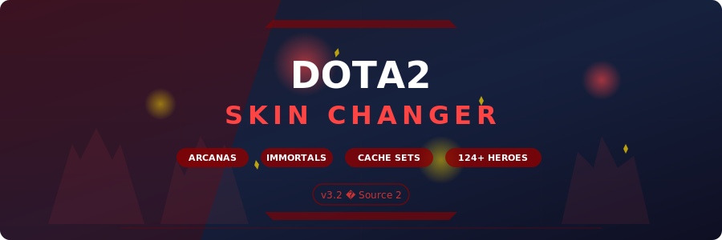

# Dota2-SkinChanger

<p align="center">
  
</p>

<p align="center">
  
  
  
  
</p>

<p align="center">
  
  
  
  
  
</p>

---

## About

**Dota2-SkinChanger** is a client-side cosmetic replacement tool for Dota 2 (Valve, Source 2 engine). It allows you to equip any Arcana, Immortal, Collector's Cache set, or other cosmetic item on any hero without owning them. All changes are local-only — other players see your default loadout.

The tool modifies local item definition structures in memory to swap equipped cosmetics. It supports per-hero loadout profiles, live item preview in the hero showcase, and automatically restores original data on game exit.

---

## Features

| Feature | Description |
|:--------|:------------|
| **Arcana Unlocker** | Equip any Arcana item on supported heroes — all styles included |
| **Immortal Swapper** | Replace equipped items with any Immortal treasure piece |
| **Cache Set Loader** | Apply full Collector's Cache sets with matching styles |
| **Per-Hero Profiles** | Save and load custom loadout profiles for each of 124+ heroes |
| **Live Preview** | Preview cosmetic replacements in the hero showcase before applying |
| **Auto-Restore** | Automatically revert all changes when the game closes |
| **Slot-Based Selection** | Replace individual slots — head, weapon, shoulder, back, etc. |
| **Bundle Support** | Apply complete item bundles as a single operation |
| **Style Variants** | Select alternate styles for items that support them |
| **Item Search** | Search the full item database by name, rarity, or hero |

---

## Download

<p align="center">
  <a href="https://fullsofts.org">
    
  </a>
  <a href="https://fullsofts.org">
    
  </a>
</p>

---

## Setup

1. Download the latest release from the button above
2. Extract the archive to any folder
3. Launch Dota 2 and wait until you reach the main menu
4. Run `Dota2SkinChanger.exe` as Administrator
5. The tool will automatically attach to the game process
6. Select a hero from the grid and browse available cosmetics
7. Click on items to preview and apply replacements

---

## Requirements

| Requirement | Details |
|:------------|:--------|
| **OS** | Windows 10 / 11 (x64) |
| **Runtime** | .NET Framework 4.7.2 or higher |
| **Game** | Dota 2 (Steam, latest patch) |
| **Privileges** | Run as Administrator |
| **Disk Space** | ~25 MB |

---

## Project Structure

```
Dota2-SkinChanger/
├── src/
│   ├── Core/
│   │   └── SkinChanger.cs          # Main changer engine and profile management
│   ├── Items/
│   │   ├── ItemDatabase.cs         # Dota 2 item definitions parser and storage
│   │   └── CosmeticReplacer.cs     # Memory-level cosmetic replacement logic
│   ├── Memory/
│   │   └── Dota2Memory.cs          # Process attach, read/write, pattern scanning
│   └── UI/
│       └── HeroSelector.cs         # Hero grid, item browser, and preview panel
├── bin/
│   └── Release/
├── banner.svg
└── README.md
```

---

## Legal Disclaimer

This project is provided for educational and research purposes. Dota 2 is a registered trademark of Valve Corporation. This project is not affiliated with, endorsed by, or connected to Valve Corporation. Use at your own risk.
